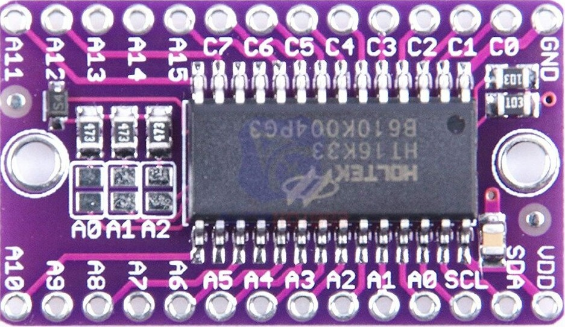
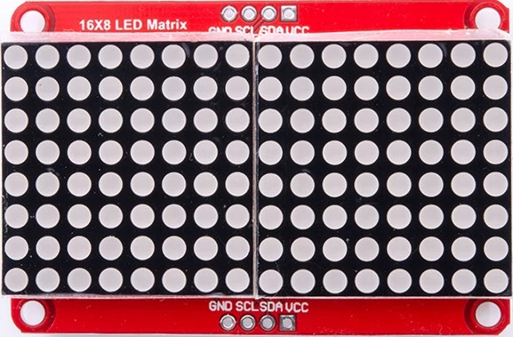
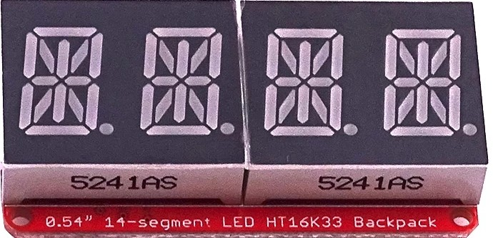

# Test de HT16K33

## Driver

Driver de leds accesible por i2c pensado para controlar matrices leds, displays de segmentos, etc

[Placa con el controlador](https://es.aliexpress.com/item/4000564451666.html)

* Voltaje de funcionamiento: 4,5 V ~ 5,5 V.
* Oscilador RC integrado.
* I2C-bus interfaz: dirección 0x70,....
* 16*8 bits de RAM para mostrar el almacenamiento de datos.
* Máximo 16x8 patrones, 16 segmentos y 8 comunes.
* Incremento automático de dirección R/W.
* Escaneo máximo de 13x3 teclas de matriz.
* Circuito de atenuación de 16 pasos.

## Led matrix 16x8

[led matrix 16x8](https://es.aliexpress.com/item/4000251830199.html)

## Display de 4 dígitos x 14 segmentos

[Display de 4 dígitos x 14 segmentos](https://es.aliexpress.com/item/4001167745165.html)

## Código para matrices, y display de 7 segmentos

[Ejemplos en python](https://smittytone.net/ht16k33-python/)

[Código](https://github.com/hybotics/Hybotics_Micropython_HT16K33)

[Documentación](https://micropython-ht16k33.readthedocs.io/en/latest/matrix.html)

## Código para matrices y display de 7 y 14 segmentos

[Código](https://github.com/hybotics/Hybotics_Micropython_HT16K33)